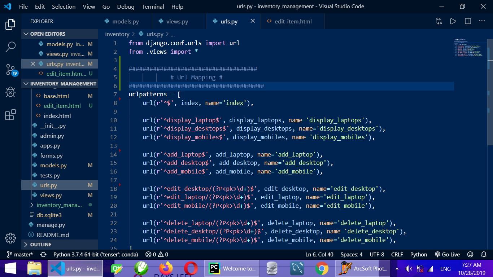

# Inventory_management

Inventory_management system using django, python and sqlite3
This is a python file not a javascript, feel free to clone and run it like you will run a normal  python file

## INTRODUCTION

This is a python inventory mnagement system built with Django and sqlite as the database,  which provides as easy way to track the products,(Phones, Desktops and Laptops). You can check out the live version on [Heroku Here](https://inventweb.herokuapp.com/)

---
### FEATURES

* Display Products 
* Export Products
* Import Products and Details
* Add New Products
* Edit Products
* Delete Products
* Search for Products
* Display All products
---

## Prerequsite 

* Install Python 3.7.3
* Django 2.2.1
* Django-import-export 1.2.0

# Installing

You can Run the git clone command on you machine within your already created Virtual Enviroment and simply run the django Command 'python manage.py runserver' after cloning

